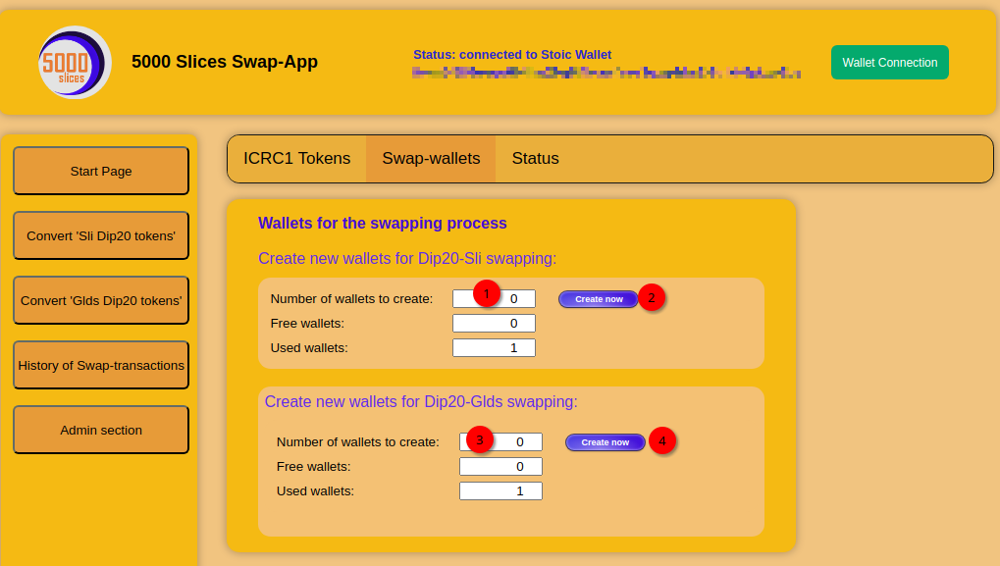

# Sli-SwapApp
App for swapping Dip20 SLICE tokens to the new ICRC1 SLI token


## Using this repository


1) Open Terminal window

2) Clone this repository:<br/>
   ```git clone https://github.com/5000slices1/Sli-SwapApp.git```

3) Navigate into the directory<br/>
```cd Sli-SwapApp```
 
4) Execute 'make install-deps' to install all needed dependencies <br/>
```make install-deps```<br/><br/>
If you see this message: <br/>
    ````
    Please reopen terminal window and execute again make install-deps because terminal needs to be restarted after DFX was installed. make: [makefile:20: install-deps] Error 127
    ````

    Then you need to reopen the terminal window and execute 'make install-deps' **again**. The reason is that the installed DFX tool can only be used after new terminal window is opened.<br/>

5) The swap-App cannot be used with local instance. It must be deployed to the ic network.<br/>
    ```dfx deploy --network ic```

6) The swap-App has an admin-page. And only logged-in owner or admin can see and use this page.<br/>    Therefore you can assign a principal as admin user. Example:<br/>
    ```
    dfx canister call SliSwapApp_backend AddAdminUser 'principal "l7ktz-3mnic-6dgyl-dnop5-wrbjo-ihmjg-eav32-fchhz-kfasq-la34v-gae"' 
    ```

    <br/> Please note: In the next chapter we will create as administrator many intermediate swap-wallets. Therefore it is best to not use admin principal where Plug-Wallet is associated, because else you would have to click away many openend windows (by PlugWallet) during this process.


## Setting up the Swap-App

1) You need to log-in with principal that is owner or admin.<br/><br/>


2) Now you should see the admin section on the left side. <br/>
   <br/>Now do the following:<br/>
   - (1) Navigate to the first tabpage 'ICRC1 Tokens'.
   - (2) Enter the ICRC1-canister-Id of the ICRC1 token that the user should get for swapping
       against SLI-Dip20 tokens.
   - (3) Click on 'Apply change' and wait 2-3 minutes until the Token-data is shown.
   - (4) and (5) Do the same for the other ICRC1 token that will be exchanged for GLDS-Dip20 tokens.
   - Now these two ICRC1 tokens needs to be transfered to the Sli-Swap-app backend canister-Id (==principal address).<br/>
     This principal-adress is shown on step (6) in the below screenshot.<br/>


3) For each user a intermediate wallet is used to deposit the Dip20 tokens. Therefore we need
   to create these wallets first. <br/>
   Please navigate now to the second tabpage 'Swap-wallets'. <br/>

    
    

    Here we can insert how many swap-wallets we want to create (1) and then with button-click (2) we will create these wallets. For every created wallet an canister-call to 'approval' will be done. And each call costs the token amount of transfer-fee. In other words: For every wallet you create 0.001 of Sli (or Glds) tokens will be used from your current logged-in wallet.
    So you also need to have enough Dip20 sli and glds tokens for the wallet creations.


4) Now it should be possible for a user to deposit and convert DIP20 SLI and GLDS tokens against
   the corresponding ICRC1 tokens. 
